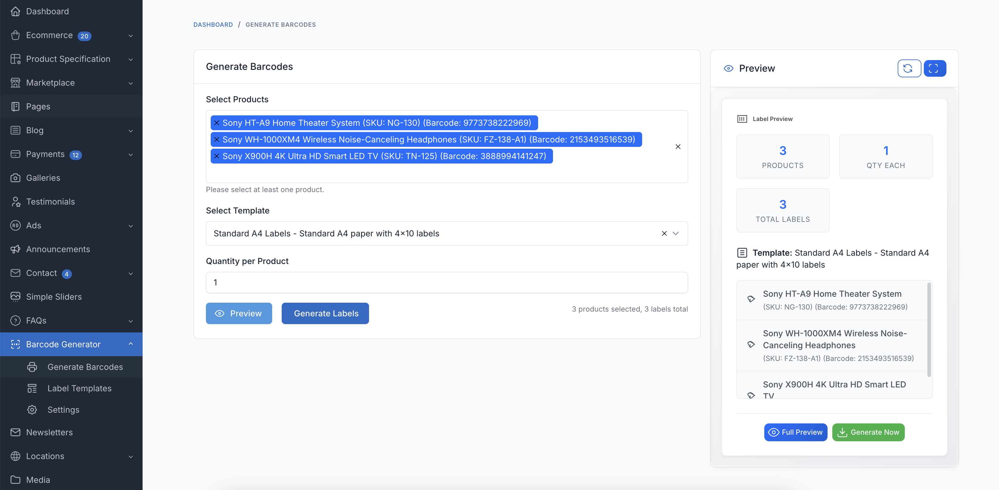
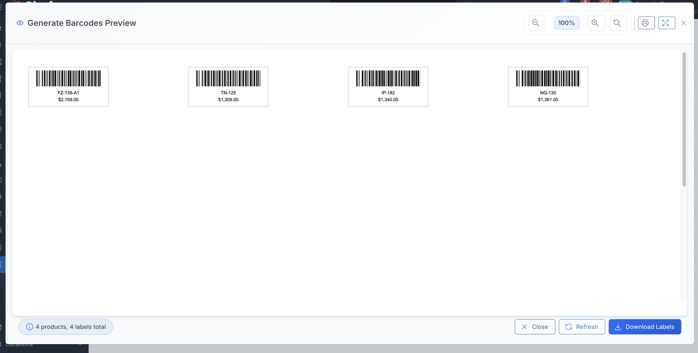
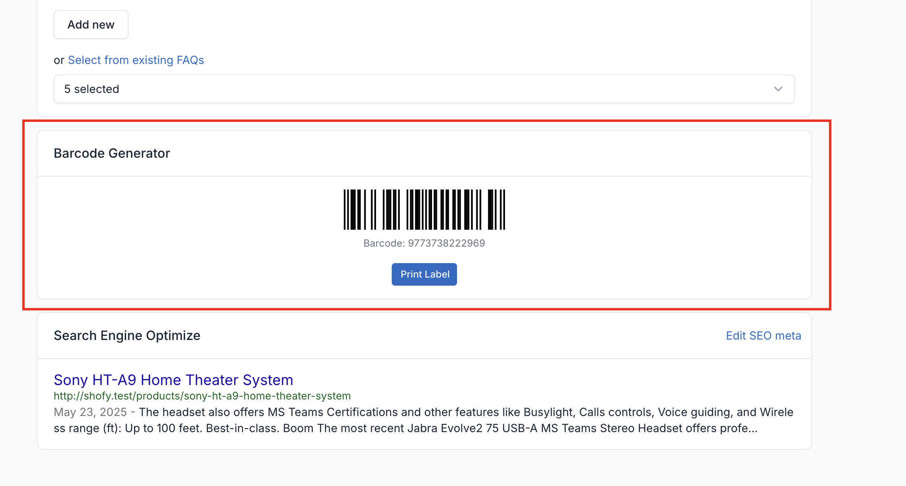

# FOB Barcode Generator

A comprehensive barcode generator plugin for Botble CMS that allows you to generate and print barcode labels for products and orders with advanced customization options and field display controls.

## Demo video

## Features

✅ **Multiple Barcode Types**
- Code 128
- EAN-13
- EAN-8
- UPC-A
- UPC-E
- QR Code
- Data Matrix

✅ **Advanced Field Display Controls**
- Granular control over which product information appears on labels
- Show/hide product name, SKU, price, brand, category, and more
- Global settings that override template configurations
- 18 different product fields to choose from including enhanced pricing options
- Smart fallback to template settings when needed

✅ **Enhanced Pricing Display Options**
- **Smart Price**: Automatically shows sale price if available, otherwise original price
- **Price with Original**: Shows both sale and original prices with strikethrough and "Sale" label
- **Sale Price Only**: Shows only discounted prices
- **Original Price Only**: Shows only regular prices
- Professional styling with red "Sale" labels and strikethrough original prices
- Solves customer confusion when products have both original and discounted prices

✅ **Flexible Label Templates**
- Customizable label sizes and dimensions
- Multiple paper formats (A4, Letter, P4, Thermal)
- Configurable margins, padding, and spacing
- Text positioning and sizing options
- Custom HTML/CSS template support
- Template management with default settings

✅ **Print Support**
- A4 and Letter paper sizes
- P4 label sheets
- Thermal printer labels (4x6, 2x1)
- Bulk printing capabilities
- Print preview functionality
- Responsive label layouts

✅ **Product Integration**
- Generate barcodes from product SKU or barcode field
- Bulk barcode generation for multiple products
- Product page integration with preview
- Admin meta box display
- Automatic barcode type detection
- Product search and filtering

✅ **Comprehensive Settings**
- Modern UI with collapsible sections
- Appearance customization (colors, borders, backgrounds)
- Batch processing settings
- Auto-generation options
- Reset to defaults functionality
- Multi-language support

## Installation

1. Extract the plugin to `platform/plugins/fob-barcode-generator`
2. Activate the plugin in Admin Panel > Plugins
3. Configure settings in Admin Panel > Settings > Others > Barcode Generator

**No composer commands required!** The plugin is completely self-contained.

## Usage

### Configuring Field Display Settings

1. Go to Admin Panel > Settings > Others > Barcode Generator
2. Navigate to the "Field Display Settings" section
3. Enable/disable which product information appears on labels:
   - Product Name (recommended)
   - Product SKU (recommended)
   - Product Price (recommended)
   - Sale Price
   - Brand, Category, Attributes
   - Description, Weight, Dimensions
   - Stock Quantity
   - Current Date, Company Name
4. Save settings - these will apply globally to all barcode generation

### Generating Barcodes

1. Go to Admin Panel > Barcode Generator
2. Select products you want to generate barcodes for
3. Choose a label template
4. Set quantity per product
5. Preview or download the labels
6. The labels will automatically include only the fields you've enabled in settings

### Managing Templates

1. Go to Admin Panel > Barcode Generator > Templates
2. Create custom templates with your preferred settings
3. Set paper size, label dimensions, and layout options
4. Configure barcode type and appearance
5. Mark templates as default for quick access
6. Templates work with global field display settings

### Advanced Settings

- **Appearance**: Customize colors, borders, and backgrounds
- **Paper Settings**: Configure paper sizes and orientations
- **Label Settings**: Set dimensions, margins, and padding
- **Advanced Options**: Enable batch mode, auto-generate SKUs
- **Reset Settings**: Restore all settings to defaults with one click

### Product Integration

- View barcode preview in product edit page
- Quick generate button in product list
- Automatic barcode type detection
- Bulk operations for multiple products

## Available Product Fields

The plugin supports displaying the following product information on barcode labels:

| Field | Description | Default |
|-------|-------------|---------|
| Product Name | The product title/name | ✅ Enabled |
| Product SKU | Stock Keeping Unit identifier | ✅ Enabled |
| Product Barcode | The product's barcode value | ❌ Disabled |
| Product Price | Regular selling price | ✅ Enabled |
| Sale Price | Discounted/promotional price | ❌ Disabled |
| Brand | Product brand/manufacturer | ❌ Disabled |
| Category | Product category | ❌ Disabled |
| Attributes | Product variations/attributes | ❌ Disabled |
| Description | Product description (truncated) | ❌ Disabled |
| Weight | Product weight | ❌ Disabled |
| Dimensions | Product dimensions (L×W×H) | ❌ Disabled |
| Stock Quantity | Available inventory | ❌ Disabled |
| Current Date | Today's date | ❌ Disabled |
| Company Name | Your company/store name | ❌ Disabled |

## Key Improvements

### 🎨 Modern UI Design
- Clean, card-based layout with shadows and rounded corners
- Collapsible sections for better organization
- Tabler icons for consistent visual design
- Responsive design that works on all devices

### ⚡ Enhanced User Experience
- Real-time field reset with smooth animations
- Loading states and progress indicators
- Smart form validation and error handling
- Intuitive help text and guidance

### 🔧 Advanced Functionality
- Global field display settings override template configurations
- Smart fallback system for backward compatibility
- Batch processing with configurable limits
- Multi-language support (English, Spanish, French, and more)

## Requirements

- PHP 8.1+
- Botble CMS 7.5.0+

## Dependencies

- **None!** The plugin includes its own barcode generation library
- All external libraries are bundled within the plugin
- No composer commands or additional installations required

## Tips & Best Practices

### 🎯 Recommended Field Settings
For most use cases, enable these fields for optimal label readability:
- ✅ Product Name (essential for identification)
- ✅ Product SKU (unique identifier)
- ✅ Product Price (customer information)
- ❌ Keep other fields disabled to avoid clutter

### 📏 Label Size Guidelines
- **Thermal 4x6**: Best for shipping labels and large products
- **Thermal 2x1**: Perfect for small items and inventory management
- **A4 Labels**: Ideal for office printers and bulk printing
- **Custom Sizes**: Use for specialized label requirements

### 🖨️ Printer Compatibility
- **Office Printers**: Use A4/Letter with multiple labels per page
- **Thermal Printers**: Use dedicated thermal sizes (4x6, 2x1)
- **Label Printers**: Configure custom dimensions as needed

### ⚡ Performance Tips
- Enable batch mode for generating large quantities
- Use appropriate barcode types (Code 128 for general use)
- Test with small batches before large print runs
- Keep field selection minimal for faster generation

## Troubleshooting

### Common Issues
1. **Barcode not generating**: Ensure product has SKU or barcode field filled
2. **Labels too small**: Adjust label dimensions in template settings
3. **Text cut off**: Reduce text size or increase label height
4. **Print quality poor**: Check printer DPI settings and label material

### Field Display Not Working
1. Verify settings are saved in Admin Panel > Settings > Barcode Generator
2. Check that at least one field is enabled
3. Clear cache if changes don't appear immediately
4. Ensure template is compatible with field settings

## License

MIT License

## Support

For support and documentation, visit [Friends of Botble](https://friendsofbotble.com)
